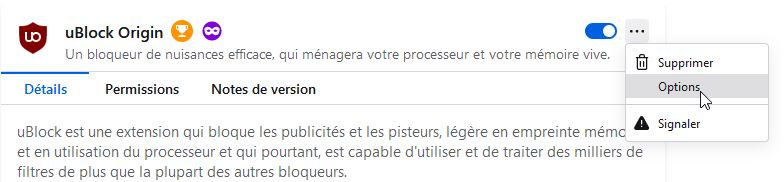
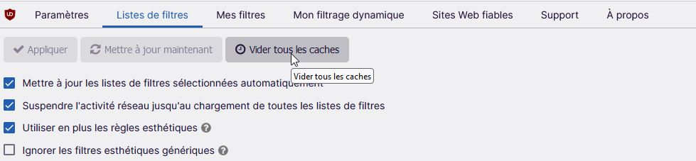
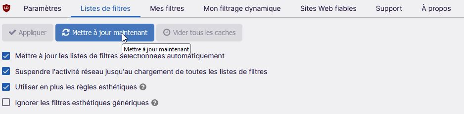

Je souhaite exprimer ma grande reconnaissance envers l'extension [**uBlock Origin**](https://addons.mozilla.org/fr/firefox/addon/ublock-origin/)
. Voici une petite astuce que l'on peut utiliser avec Firefox pour se débarrasser des publicités qui apparaissent au début de chaque vidéo sur YouTube. De cette manière, je réussis à prévenir la frustration qui surgit après une courte période de visionnage de vidéos, évitant ainsi le désir occasionnel de réagir de façon impulsive envers mon écran.

**Outils** > **Extensions et thèmes** > **uBlock Origin** > **Notes de version**
(vérifier d'avoir la version min 1.52.0)

Ouvrir les **Options** de uBlock

Puis cliquer sur **Vider tous les caches**

Pour finir cliquer sur **Mettre à jour maintenant**

YouTube est à nouveau dépourvu de toute publicité.
